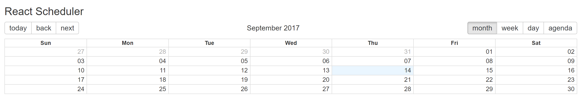
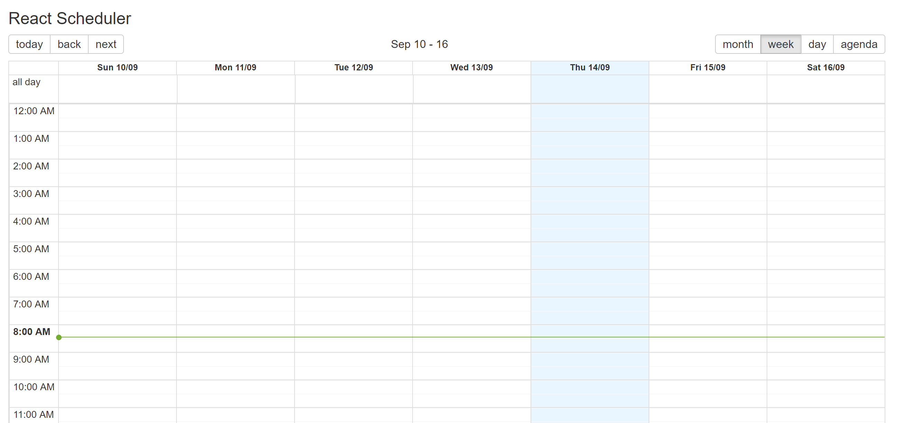

# React Scheduler

Schedule calls online

## Project Purpose

Needed a project to practice React with. So I built this.

## Key Features

* Month, Week, Day views

* Schedule new events

## Key Tools

React

## Acknowledgments

* Horizons School of Technology
* , which handled most of the front end design
